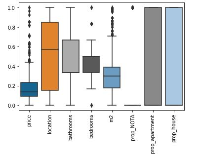
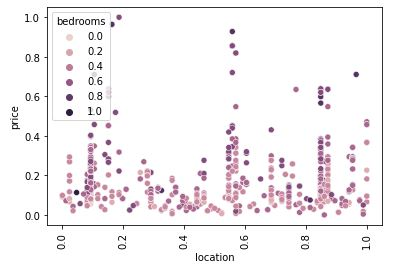
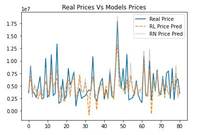

# 🏡 Real Estate Market Research

This project was developed as a final Master’s thesis over approximately five months, focusing on analyzing the current real estate landscape through web scraping and machine learning. The goal was to gain insights into pricing patterns and market segmentation across newly launched and ongoing real estate projects.

The project was fully executed in a local environment and includes a complete data pipeline—from data extraction to visualization.

It explores how data science can help understand the real estate market in cities of personal or investment interest, and how price predictions and property grouping can guide better decision-making.

---

## 🔍 About this project

> ⚙️ This project was carried out as part of a final academic requirement, but it simulates real-world market research scenarios, leveraging practical tools for data acquisition, processing, and analysis. While the solution was not deployed to the cloud, all workflows were built with production-oriented structure and scalability in mind.

> 🔄 Note: The current version of the scraping spider may not be fully functional due to changes in the target website. However, the code and structure remain available as a reference for adaptation. The approach is reproducible and can be applied to different cities or platforms with minimal adjustments.

---

## 📅 Duration

- **Timeline:** ~5 months (Final Master Project)
- **Phases:** Planning, data acquisition, processing, modeling, and reporting

---

## 🚀 Tech Stack

- Python (Scrapy, BeautifulSoup, pandas, NumPy, scikit-learn, TensorFlow/Keras)
- Jupyter Notebooks
- Matplotlib, Seaborn, Plotly (for visualization)

---

## 🧩 Features

- Web scraping from real estate marketing platforms (custom spiders)
- Data cleaning and ETL processes
- Statistical analysis and market behavior exploration
- Market segmentation using clustering (unsupervised learning)
- Predictive modeling for property pricing (supervised learning)
  - Linear Regression
  - Convolutional Neural Networks (CNN)
- Comparative evaluation of model performance
- Structured reporting and visualization in Jupyter Notebooks

---

## 📒 Notebook Structure

| Section                          | Description                                                                 |
|----------------------------------|-----------------------------------------------------------------------------|
| Importing Libraries              | Required Python libraries for scraping, ML, and visualization               |
| Web Scraping                     | Custom Scrapy spider to extract real estate listings                        |
| Data Loading and Cleaning        | CSV import, missing value handling, basic EDA                              |
| Data Preprocessing               | Encoding, scaling, and preparation for ML models                           |
| Model Training                   | Linear Regression and CNN for price prediction                             |
| Evaluation and Comparison        | Metric-based comparison of model results                                   |
| Visualization                    | Seaborn/Matplotlib plots for trends and predictions                        |

To explore the logic, analysis, and models used, the main Jupyter Notebook can be found in the repository here:  
👉 [Main Analysis Notebook](https://github.com/dataismyname/real_estate_web_scrapping_analysis/blob/main/real_estate_analysis.ipynb)

---

## 🖼️ Sample Visualizations

Below are a few examples of the visual outputs generated during the project:

### 📊 Feature Distribution and Property Types  
  
This boxplot shows the distribution of key numerical and categorical features used in the modeling process. All variables were normalized for better comparison. It includes:

- `price`, `location`, `bathrooms`, `bedrooms`, `m2`: main continuous variables.
- `prop_NOTA`, `prop_apartment`, `prop_house`: property type indicators (one-hot encoded).

This visualization helped identify outliers and understand the spread and scale of the features.

---

### 🧭 Location vs. Price Colored by Bedrooms  
  
This scatter plot displays the relationship between property **location** (normalized) and **price**, with color intensity representing the number of **bedrooms**. 

- Each point corresponds to a property.
- Darker shades indicate more bedrooms, while lighter ones indicate fewer.
- This visualization helps explore whether certain locations are associated with higher prices or larger properties.

It’s useful to detect clusters, pricing anomalies by location, and the possible influence of bedroom count on pricing across different zones.

---

### 📈 Price Prediction: Real vs. Predicted Comparison  
  
This line plot compares actual property prices with predictions from two models:

- **RL Price Pred**: Linear Regression.
- **RN Price Pred**: Neural Network.

Both models follow the real trend closely, but the neural network shows a better response to extreme price variations, indicating a more flexible fit.

---

## 📊 Summary

This project explores pricing trends and market behavior in the real estate sector. Data was obtained through web scraping campaigns and processed into structured datasets for analysis. Market segments were identified using clustering algorithms, and property price predictions were modeled using regression techniques and neural networks.

While the pipeline and models were run in a local environment, the architecture allows for future migration to cloud-based solutions with API or dashboard deployment if desired.

The original analysis was focused on a specific Mexican city, but the methodology is easily adaptable to other regions or countries by modifying the target source and data parsing rules.

---

## 🔭 Future Work

This project serves as the foundation for a more robust real estate analytics platform. Potential next steps include:
- Feeding the data into a structured database (e.g., PostgreSQL, MySQL) to allow broader querying and integration.
- Expanding the data model with new variables relevant to real estate appraisals.
- Developing a modular, production-ready application to serve predictions via API or web interface.
- Exploring dynamic dashboards or automated reports for different cities or investment scenarios.

These enhancements would enable a more complete decision-support system for real estate professionals or investors.

---

## 👤 Author

- **Name:** David A. Tirado A.
- **GitHub:** [@dataismyname](https://github.com/dataismyname)
- **Email:** [datirado@dataexpn.com](mailto:datirado@dataexpn.com)
- **Project Repo:** [Real Estate Web Scraping & Analysis](https://github.com/dataismyname/real_estate_web_scrapping_analysis)

